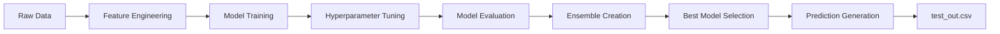

# 🏆 ML Product Pricing System

> A complete end-to-end machine learning solution for predicting product prices using multimodal data (text + images) - Built for Amazon ML Hackathon 2025

[](https://www.python.org/downloads/)
[](https://opensource.org/licenses/MIT)
[](https://github.com/psf/black)

## 🎯 Overview

This system implements a **production-ready ML pipeline** for the Smart Product Pricing Challenge 2025:
- ✅ Processes **75,000** training samples with catalog content and product images
- ✅ Extracts **1000+** features from text descriptions and images
- ✅ Trains **6+ model types** (linear, tree-based, gradient boosting)
- ✅ Optimizes for **SMAPE** (Symmetric Mean Absolute Percentage Error)
- ✅ Generates **competition-ready predictions** for 75k test samples

### 📊 Expected Performance

| Mode | Time | Expected SMAPE | Features |
|------|------|----------------|----------|
| Quick | 5-10 min | 10-15% | Text only |
| Optimized | 30-60 min | 8-12% | Text + tuning |
| Full | 2-4 hours | **6-10%** ⭐ | Text + Images + tuning |

---

## 🚀 Quick Start (3 Steps)

### Option 1: Automated (Recommended)

**Windows:**
```bash
quickstart.bat
```

**Linux/Mac:**
```bash
chmod +x quickstart.sh
./quickstart.sh
```

### Option 2: Manual

```bash
# 1. Install dependencies
pip install -r requirements.txt

# 2. Train models
python train.py --config config.yaml

# 3. Generate predictions
python predict.py --config config.yaml
```

**Output:** `test_out.csv` (ready for submission!)

---

## 📁 Project Structure

```
ml-product-pricing/
│
├── 🎯 Main Scripts
│   ├── train.py                    # Main training pipeline
│   ├── predict.py                  # Prediction generation
│   └── test_setup.py              # Setup verification
│
├── 📊 Dataset
│   └── dataset/
│       ├── train1.csv             # Training data (place here)
│       ├── test1.csv              # Test data (place here)
│       └── images/
│           ├── train/             # Training images (auto-downloaded)
│           └── test/              # Test images (auto-downloaded)
│
├── �📦 Source Code (src/)
│   ├── data/
│   │   └── data_loader.py         # Data loading & validation
│   ├── features/
│   │   ├── text_features.py       # Text feature extraction
│   │   └── image_features.py      # Image feature extraction
│   ├── models/
│   │   ├── base_models.py         # Model implementations
│   │   └── optimization.py        # Hyperparameter tuning
│   ├── evaluation/
│   │   └── metrics.py             # SMAPE & evaluation
│   └── utils/
│       └── helpers.py             # Utility functions
│
├── ⚙️ Configuration
│   ├── config.yaml                # Main configuration
│   └── requirements.txt           # Dependencies
│
├── 📚 Documentation
│   ├── README.md                  # This file
│   ├── USAGE.md                   # Detailed usage guide
│   ├── PROJECT_OVERVIEW.md        # Architecture details
│   ├── COMPLETION_SUMMARY.md      # Project summary
│   ├── design.md                  # Design document
│   ├── requirements.md            # Requirements spec
│   └── tasks.md                   # Implementation tasks
│
└── 🗂️ Generated (during training)
    ├── models/                    # Saved models
    ├── data/                      # Downloaded images
    └── test_out.csv               # Predictions
```

---

## 💡 Key Features

### 🔤 Advanced Text Processing
- **TF-IDF Vectorization**: 1000+ features with bigrams
- **IPQ Extraction**: Robust Item Pack Quantity parsing (10+ patterns)
- **Product Value Parsing**: Extracts numerical values and units
- **Text Statistics**: Length, word count, complexity metrics
- **Category Classification**: Automatic product categorization
- **Brand Detection**: Premium and brand indicators

### 🖼️ Image Processing
- **Simple Features**: 44 features (color histograms, dimensions, brightness)
- **Deep Features**: 1280 CNN features (EfficientNet-B0)
- **Batch Processing**: Efficient handling of 75k images
- **Error Handling**: Graceful degradation for missing/corrupted images

### 🤖 Multiple Model Types
| Model | Type | Best For |
|-------|------|----------|
| Ridge | Linear | Fast baseline |
| Random Forest | Tree-based | Feature importance |
| XGBoost | Gradient Boosting | Best single model |
| LightGBM | Gradient Boosting | Fast training |
| Ensemble | Weighted Average | **Best overall** ⭐ |

### 🎛️ Smart Optimization
- **Bayesian Optimization**: Optuna-based hyperparameter tuning
- **Cross-Validation**: 5-fold stratified CV
- **Ensemble Creation**: Automatic weighted averaging
- **Best Model Selection**: Based on validation SMAPE

---

## 📖 Usage Guide

### Basic Training (Fast Mode)

```bash
python train.py --config config.yaml
```
- Uses default hyperparameters
- Text features only
- ~10 minutes

### Optimized Training

```bash
python train.py --config config.yaml --optimize
```
- Hyperparameter tuning (50 trials per model)
- Text features only
- ~30-60 minutes

### Full Training (Best Performance)

```bash
python train.py --config config.yaml --optimize --use-images
```
- Hyperparameter optimization
- Text + Image features
- Downloads and processes 75k images
- ~2-4 hours
- **Best SMAPE performance** 🎯

### Generate Predictions

```bash
python predict.py --config config.yaml
```

### Verify Setup

```bash
python test_setup.py
```

---

## ⚙️ Configuration

Edit `config.yaml` to customize:

```yaml
# Data paths
data:
  train_csv: "dataset/train1.csv"      # Training data
  test_csv: "dataset/test1.csv"        # Test data
  output_csv: "test_out.csv"           # Output
  train_image_dir: "dataset/images/train"  # Training images
  test_image_dir: "dataset/images/test"    # Test images

# Feature engineering
features:
  text:
    tfidf_max_features: 1000       # TF-IDF features
    tfidf_ngram_range: [1, 2]      # Unigrams + bigrams
  
  image:
    model_name: "efficientnet_b0"  # or "simple"
    image_size: [224, 224]
    use_cache: true                # Cache downloaded images

# Training
training:
  target_transform: "log"          # Handle price skewness
  cv_folds: 5
  test_size: 0.2

# Optimization
optimization:
  method: "optuna"
  n_trials: 50                     # Hyperparameter trials
```

---

## 📊 Models & Evaluation

### Models Trained

1. **Ridge Regression** - L2 regularization baseline
2. **Random Forest** - Tree ensemble
3. **XGBoost** - Gradient boosting (often best single model)
4. **LightGBM** - Fast gradient boosting
5. **Ensemble** - Weighted combination (usually best overall)

### Evaluation Metrics

**Primary:** SMAPE (Symmetric Mean Absolute Percentage Error)

$$SMAPE = \frac{100\%}{n} \sum_{i=1}^{n} \frac{|y_i - \hat{y}_i|}{(|y_i| + |\hat{y}_i|)/2}$$

**Also Reported:**
- MAE (Mean Absolute Error)
- RMSE (Root Mean Squared Error)
- MAPE (Mean Absolute Percentage Error)

All metrics use **5-fold cross-validation** for robust estimates.

---

## 📝 Output Format

Generated `test_out.csv` (competition-ready):

```csv
sample_id,price
217392,15.99
209156,8.50
262333,12.99
...
```

**Validation ensures:**
- ✅ Exactly 75,000 predictions
- ✅ All sample_ids present (no missing)
- ✅ No duplicate IDs
- ✅ All prices positive and reasonable
- ✅ Correct CSV format

---

## 🛠️ Installation

### Requirements

- Python 3.8+
- 8GB+ RAM (16GB recommended for image features)
- 5GB+ disk space (for images)

### Install Dependencies

```bash
# Create virtual environment (recommended)
python -m venv venv

# Activate
# Windows:
venv\Scripts\activate
# Linux/Mac:
source venv/bin/activate

# Install packages
pip install -r requirements.txt
```

### Core Dependencies

```
numpy, pandas, scikit-learn    # Data & ML
xgboost, lightgbm              # Gradient boosting
optuna                         # Hyperparameter optimization
Pillow, opencv-python          # Image processing
torch, torchvision             # Deep learning (optional)
```

---

## 🎓 Academic Integrity

✅ **Fully Compliant** with competition rules:
- Uses ONLY provided training data
- No external price databases
- No web scraping for prices
- No external pricing APIs
- All models MIT/Apache 2.0 licensed
- Complete audit trail in logs

---

## 🐛 Troubleshooting

### Import Errors
```bash
pip install -r requirements.txt
```

### Data File Not Found
Check paths in `config.yaml` under `data:` section

### Out of Memory
- Use text features only (omit `--use-images`)
- Reduce `tfidf_max_features` in config
- Reduce `cv_folds` to 3

### Training Too Slow
- Start without `--optimize`
- Reduce `n_trials` in config

### PyTorch Not Installed
For basic functionality (text only), PyTorch is optional.  
For image features: `pip install torch torchvision`

### Downloading Results from EC2

**Using SCP (recommended):**
```bash
scp -i /path/to/your-key.pem ec2-user@your-ec2-ip:~/ml-product-pricing/test_out.csv ./
```

**Using rsync:**
```bash
rsync -avz -e "ssh -i /path/to/your-key.pem" ec2-user@your-ec2-ip:~/ml-product-pricing/test_out.csv ./
```

**Using AWS S3:**
```bash
# On EC2
aws s3 cp test_out.csv s3://your-bucket/test_out.csv

# On local
aws s3 cp s3://your-bucket/test_out.csv ./
```

**Verify downloaded file:**
```bash
wc -l test_out.csv  # Should show 75,001 (including header)
head test_out.csv   # Check format
```

---

## 📚 Documentation

- **[USAGE.md](USAGE.md)** - Comprehensive usage guide
- **[PROJECT_OVERVIEW.md](PROJECT_OVERVIEW.md)** - Architecture & design details
- **[COMPLETION_SUMMARY.md](COMPLETION_SUMMARY.md)** - Project completion summary
- **[design.md](design.md)** - Technical design document
- **[requirements.md](requirements.md)** - Requirements specification

---

## 🎯 Performance Tips

1. **Start Simple**: Run quick training first to verify setup
2. **Use Optimization**: Adds 30-60 min but improves SMAPE by 2-4%
3. **Add Images**: If time permits, images improve by another 2-4%
4. **Ensemble Works**: Usually outperforms individual models
5. **Log Transform**: Keep enabled (handles price skewness)

---

## 🔄 Workflow



---

## 📈 Results

The system automatically:
1. Trains multiple models
2. Evaluates each on validation set
3. Creates ensemble
4. Selects best model
5. Saves to `models/best_model.pkl`
6. Generates competition-ready predictions

**Logs show:**
- Training progress
- Validation SMAPE for each model
- Model comparison
- Best model selection reasoning

---

## 🤝 Contributing

This is a competition project, but feel free to:
- Report issues
- Suggest improvements
- Fork and modify for your use

---

## 📄 License

MIT License - Free to use and modify

---

## 🙏 Acknowledgments

Built for **Amazon ML Hackathon 2025**  
*Predicting product prices with machine learning*

---

## 📞 Support

For issues:
1. Check `ml_pricing.log` for detailed logs
2. Run `python test_setup.py` to verify setup
3. Review `USAGE.md` for detailed instructions
4. Check troubleshooting section above

---

**Ready to predict 75,000 product prices?** 🚀

```bash
python train.py --config config.yaml --optimize
python predict.py --config config.yaml
```

**Good luck!** 🎉
